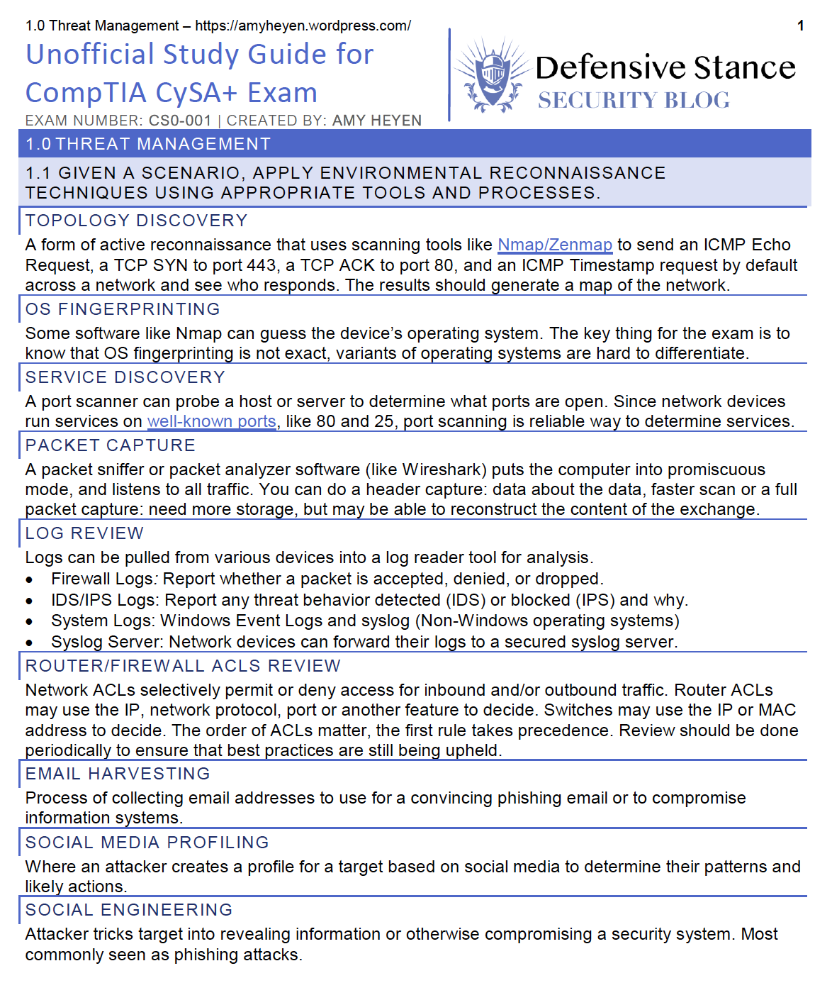

<small><a href="https://unsplash.com/@fabimoe" target="_blank" rel="noopener noreferrer">Photo by Fabian Møller on Unsplash</a></small>

This is a retrospective post on everything I did to help me pass the CySA+.  While studying, I compiled my notes into 30 pages with brief summaries of each of the CySA+ objectives, and a TON of links to additional learning materials, bringing the final document to 12988 words! My [Unofficial CySA+ Certification Study Guide](./unofficial-study-guide-for-comptia-cysa.pdf) (pdf) is freely available for personal use and sharing with credit to me, but not available to make a profit on. The personal branding is from my old wordpress blog, don't worry about that, the content is still great. I’m proud of this and it helped me organize my notes, identify weak points in my studies and explore concepts. 

My study guide was heavily insprired by the awesome resources provided by Proffessor Messer who's materials I recommend for all entry level CompTIA certifications (Network+, Security+, A+, etc.). I recommend watching his video series for the Security+ on YouTube [Playlist 1](https://www.youtube.com/playlist?list=PLG49S3nxzAnkcKd71N4OjSv4cUXNhoPlQ) & [Playlist 2](https://www.youtube.com/playlist?list=PLG49S3nxzAnlhMM1KV5ST1qi3kI87hMpY) (both free) to get the basics before studying for the CySA+ if you don't already have the Security+ or it's been a while. 

## Resources Used

* 📖   Reading: [CompTIA CySA+ Cybersecurity Analyst Certification All-in-One Exam Guide (CS0-001)](https://www.amazon.com/gp/product/B074BTJW57/ref=oh_aui_d_detailpage_o03_?ie=UTF8&psc=1) The book is well written, I haven’t even fallen asleep reading it. There are relevant quotes at each chapter start and does well at presenting information in a casual but informative way.
* 📝   Practice Tests: [CompTIA CySA+ Practice Tests: Exam CS0-001](https://www.amazon.com/CompTIA-CySA-Practice-Tests-CS0-001/dp/1119433207/). This book has tons of practice questions, some more advanced than I saw on the test, but many had similar content to what I saw on the test.
* 🎥   Videos: [Cybrary CySA+ Series](https://app.cybrary.it/browse/course/comptia-cysa-2018) The voice on the instructor can be a bit drone-like, as is common with technical videos, but the content is good and they give great practice exercises to do. For example, running wireshark while you try different nmap commands to see what port scanning can do and what that traffic really looks like. 
* 🥼   Labs: [Cybrary CySA+ Virtual Labs](https://app.cybrary.it/browse/practice_labs/comptia-cybersecurity-analyst-csa). The labs give you practice with many of the tools discussed in the CySA+. As the CySA+ is geared to actual job positions analyzing network and security logs, it goes over many different tools and operating systems that may be used in such a role. Getting hands-on experience with the tools in the certification objectives is key for not only passing the exam, but for your future job position! This was definitely my favorite part of studying for the exam. My write up blog post on my [NMAP Wireshark activity](../nmap-wireshark-lab) was a ton of fun. This was the first time for me, that studying for a certification actually felt applicable for the real world and not just theory.

## General Certification Study Tips

Here are some tips & tricks a friend gave me from her trainer that I found helpful:

1. DON’T CRAM the night before!….all this does is cloud your head with too much information to process correctly in the ~90 minutes you have to take the exam.
1. EAT BRAIN FOOD the night before. I like to say that Salmon is a good idea…but really any fish is good for that.
1. TRY to get a good night of sleep. I know that you will be worried about the exam, but YOU REALLY NEED some sleep for your brain to work optimally. 
1. EAT SOMETHING before you take the exam (whether it is breakfast or lunch, depending on when your exam is that day). NOT a heavy meal, but enough that your brain has fuel.
1. Know IN ADVANCE, where the exam center is at. Know IN ADVANCE how long it should take you to get there….and add 15-20 minutes to that time (unless you live or work within walking distance of the exam center). Traffic has a nasty habit of happening at the most in-opportune moments.
1. TAKE YOUR TIME. You have ~90 minutes for approximately 75 questions (for a Sec+ exam as an example).
1. SIMULATIONS: Do this! FLAG THE QUESTION FOR REVIEW! In the upper left corner of the screen is a yellow flag. It’s there for you to mark a question to go back to later. USE THIS TOOL as a time management tool. When you do the SIM, the clock goes away…meaning…you lose track of time. That is a bad thing on a timed exam. By flagging the SIM, you move it to the end of the exam…AFTER you have done the rest of the questions. PLEASE FLAG the SIMs and do them at the end. It will improve your time management….which is CRITICAL on these exams.
1. RTFQ: Read the FULL Question. Do not do the “skimming” of the question. Do not fall into the TL/DR (Too Long/Didn’t Read) trap that people who are “attached-to-their-smartphone-and-only-read-140-characters-or-less” always seem to do. YOU HAVE TO READ THE WHOLE QUESTION….INCLUDING ALL of the answers.
1. Ask yourself “WHAT are they asking me?” If the question is about a network, then the answer is PROBABLY going to be a NETWORK answer….duh!
1. If you spend more than a minute or so on a question “staring at the screen”, FLAG IT and move on. The engine is going to ask you at the end about the flagged questions anyway. Think TIME MANAGMENT.
1. If your gut is SCREAMING AT YOU that it is “C”, there is a good probability that it is “C”If you “think” the answer is “B” but you are not sure, mark “B” —-AND—- FLAG the question. There might be a later question during the exam that will confirm your “think”.
1. RE-READ ALL of the FLAGGED questions at the end ALL THE WAY THRU and ask yourself again “WHAT are they asking me?”
1. Once you are done (as in DONE-DONE) and you get ready to submit the exam, your first instinct is going to be “I F&(%ed that up!”…that is NORMAL to feel that….

### Note on Attachment

*Cropped Screenshot of the front page*
* Author: Amy Heyen
* Link: [Unofficial CySA+ Certification Study Guide](../assets/docs/unofficial-study-guide-for-comptia-cysa.pdf)
* File Type: pdf
* File Name: unofficial-study-guide-for-comptia-cysa.pdf
* SHA256 Hash `fc26eeb569dabfdbc68ee9a165d0734ee02374efb6b978513dde56f8a496b360`