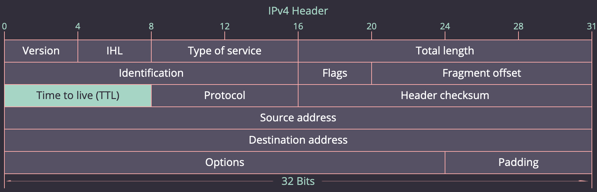
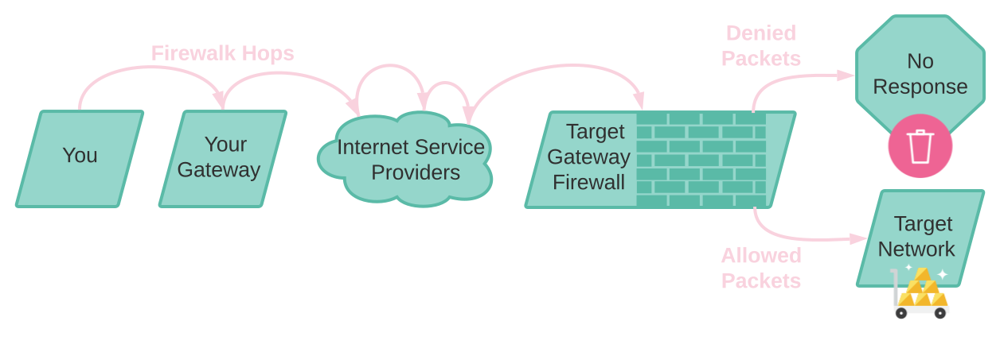

<small><a href="https://unsplash.com/photos/RPUI6gtn49g" target="_blank" rel="noopener noreferrer">Photo by Joshua Newton on Unsplash.</a> Note from photographer:

<blockquote>This is the sacred Sanghyang Djaran. A classical Balinese performance, told through fire and trance dance. The barefoot horse man moves around and through a bonfire made from coconut husks, kicking and dancing in a state of trance. I was excited to travel to Indonesia to explore it’s abundant greenery and beautiful environments… I never knew I’d stumble across something this magical.</blockquote></small>

<small><i>Yes, that really is the logo taken directly from the website and yes, it does have that amazing Geocities vibe.</i></small>

I'm in an Ethical Hacking course now in school and I went through my first lab involving a little tool that comes natively with [Kali Linux](https://www.kali.org/), [Firewalk](http://packetfactory.openwall.net/projects/firewalk/). I felt like the lab showed one use for the tool but failed to elaborate on what the tool is and why we did what we did. So I decided to try and tackle those concepts in this blog.

## About Firewalk

The Firewalk tool was created in 1998! It's old enough to legally drink in the US, so cheers to you Firewalk. 🍻

To understand how the tool works, it's important to understand a little bit about packets. If you're a packet master, [skip this section.](#how-to)

Firewalk utilizes the Time To Live (TTL) also known as hop limit to determine if a network port is open in a firewall. The hop limit is a value in IP headers that can restrict how many hops or routers the packet passes through. Routers look at this TTL value and if the hop limit is not zero, the router will decrease the TTL value by one and continue to forward the packet to the destination. If the hop limit is zero, the router will send an ICMP Time Exceeded message back to the sender. 

Firewalk works a lot like `traceroute` or `tracert`. The first thing Firewalk has to determine how many hops it takes to get to the target gateway. It does so by sending packets one at a time with TTL values that gradually increase until it reaches the target. The target should send an ICMP port unreachable or an ICMP echo reply instead of an ICMP Time Exceeded message.

Once Firewalk has the hop count to the target gateway, it will increase the TTL one more time and begin the requested scan. The actual target host may be many hops beyond this target gateway, but if the tool can't get a response past that gateway, then you can assume that whatever protocol you tried to pass is being blocked. *Note: This helps with getting through border gateways, but may not help with host firewalls or segmented networks.* 

## How to use the Tool

The firewalk website was last updated in 2003 and doesn't have much for documentation unless you enjoy pdf's from 1998 or a book from 2002. The better documentation is on [Kali Linux's Firewalk tool page](https://tools.kali.org/information-gathering/firewalk).

Firewalk is an active reconnaisance tool. This means that it sends packets to the target network and could potentially be identified by your target. For any active reconnaisance tools, the goal is to be slow and steady and also to rotate or mark your sending IP with something like a VPN. So that if one IP is blocked, another can be used and you are not bothered by it.

Firealk has two phases, the ramping phase which uses network discovery like `traceroute`/`tracert` to determine the hops to the target gateway. And the scanning phase which checks ports on the target gateway for responses. 

### Table of Contents: 

* [No options](#no-options)
* [firewalk -h](#h-option)
* [firewalk -d 0 - 65535](#d-option)
* [firewalk -i device](#i-option)
* [firewalk -n](#n-option)
* [firewalk -p TCP | UDP](#p-option)
* [firewalk -r](#r-option)
* [firewalk -S x - y, z](#S-option)
* [firewalk -s 0 - 65535](#s-option)
* [firewalk -T 1 - 1000](#T-option)
* [firewalk -t 1 - 25](#t-option)
* [firewalk -x 1 - 8](#x-option)
* [Full example](#full-example)
* [Nmap example](#nmap)

### No options

Firewalk must be run at a target_gateway and a metric. The target gateway is the IP of the network you are attacking and the metric is a host IP behind the gateway. For example:

    root@kali:~# firewalk 192.168.9.1 192.168.68.12
    Firewalk 5.0 [gateway ACL scanner]
    Firewalk state initialzation completed successfully.
    UDP-based scan.
    Ramping phase source port: 53, destination port: 33434
    Hotfoot through 192.168.9.1 using 192.168.68.12 as a metric.
    Ramping Phase: 
     1 (TTL 1): expired [192.168.9.1]
     Binding host reached.
     Scan bound at 2 hops.
     Scanning Phase:
     port   1: A! unknown (unreach ICMP_UNREACH_PORT) [192.168.68.12]
     port   2: ...

The scanning phase proceeds for a total of 133 ports if no limitation is defined. 

    Scan completed successfully.

    Total packets sent:                133
    Total packet errors:               0
    Total packets caught:              224
    Total packets caught of interest:  91
    Total ports scanned:               132
    Total ports open:                  0
    Total ports unknown                90

<small>Return to the <a href="#TOC">Table of Contents</a>.</small>

### firewalk -h 

Provides a quick help guide explaining the various options to use in commandline. 

    root@kali:~# firewalk -h
    Firewalk 5.0 [gateway ACL scanner]
    Usage : firewalk [options] target_gateway metric
            [-d 0 - 65535] destination port to use (ramping phase)
            [-h] program help
            [-i device] interface
            [-n] do not resolve IP addresses into hostnames
            [-p TCP | UDP] firewalk protocol
            [-r] strict RFC adherence
            [-S x - y, z] port range to scan
            [-s 0 - 65535] source port
            [-T 1 - 1000] packet read timeout in ms
            [-t 1 - 25] IP time to live
            [-v] program version
            [-x 1 - 8] expire vector

<small>Return to the <a href="#TOC">Table of Contents</a>.</small>

### firewalk -d 0 - 65535 

Designate your destination port to use for the ramping phase of the scan. The ramping phase is the phase it uses to determine how many hops to the target gateway. Sometimes the default port may already be in use or may be blocked and another port may be used instead. See how the destination port changes from the default 33434 to 12345 when you run the below example.

    root@kali:~# firewalk -d 12345 192.168.9.1 192.168.68.12
    Firewalk 5.0 [gateway ACL scanner]
    Firewalk state initialzation completed successfully.
    UDP-based scan.
    Ramping phase source port: 53, destination port: 12345

<small>Return to the <a href="#TOC">Table of Contents</a>.</small>

### firewalk -i device 

Use the -i option if you have multiple network interfaces to specify which interface for the tool to use. For example: 
    
    root@kali:~# firewalk -i eth0 192.168.9.1 192.168.68.12

<small>Return to the <a href="#TOC">Table of Contents</a>.</small>

### firewalk -n 

The -n option tells firewalk to not resolve IPs into hostnames. This helps speed up the scan and reduce noise in the scan results particularly when traversing across Internet Service Providers (ISPs). For example:

    root@kali:~# firewalk -n 192.168.9.1 192.168.68.12

<small>Return to the <a href="#TOC">Table of Contents</a>.</small>

### firewalk -p TCP | UDP

Use the -p option to specify if you are running a scan for TCP or UDP ports. The default is UDP.

    root@kali:~# firewalk -p TCP 192.168.9.1 192.168.68.12
    Firewalk 5.0 [gateway ACL scanner]
    Firewalk state initialzation completed successfully.
    TCP-based scan.

<small>Return to the <a href="#TOC">Table of Contents</a>.</small>

### firewalk -r 

This provides srict RFC adherence. Some firewalls may drop or flag packets that do not meet RFC standards. RFCs are internet standards. More information can be found on the [Internet Engineering Task Force (IETF) website](https://www.ietf.org/standards/rfcs/). For example:

    root@kali:~#firewalk -r 192.168.9.1 192.168.68.12

This one may require a wireshark packet capture to view the difference. When I was learning the tool, I didn't do that but if I remember, I'll try it later.

<small>Return to the <a href="#TOC">Table of Contents</a>.</small>

### -S x - y, z 

This is an important option that sets what ports you would like to scan.

    root@kali:~# firewalk -S 53 -d 53 192.168.9.1 192.168.68.12
    Firewalk 5.0 [gateway ACL scanner]
    Firewalk state initialzation completed successfully.
    UDP-based scan.
    Ramping phase source port: 53, destination port: 53
    Hotfoot through 192.168.9.1 using 192.168.68.12 as a metric.
    Ramping Phase: 
     1 (TTL 1): expired [192.168.9.1]
    Binding host reached.
    Scan bound at 2 hops.
    Scanning Phase:
    port  53: unknown (unreach ICMP_UNREACH_HOST) [192.169.9.1]
    
    Scan completed successfully.

    Total packets sent:                2
    Total packet errors:               0
    Total packets caught:              4
    Total packets caught of interest:  2
    Total ports scanned:               1
    Total ports open:                  0
    Total ports unknown                1

In my example, I scanned port port 53 (DNS) by using the -S option to set the port for the scanning phase and the -d option to set the port for the ramping phase. The result ICMP_UNREACH_HOST indicates that a firewall rule may be in place.

<small>Return to the <a href="#TOC">Table of Contents</a>.</small>

### -s 0 - 65535 

Designate your source port to use for the ramping phase of the scan. Again some situations on your own PC or network may need you to set a different port than the default. Example:

    root@kali:~# firewalk -s 12345 192.168.9.1 192.168.68.12
    Firewalk 5.0 [gateway ACL scanner]
    Firewalk state initialzation completed successfully.
    UDP-based scan.
    Ramping phase source port: 12345, destination port: 33434

<small>Return to the <a href="#TOC">Table of Contents</a>.</small>

### firewalk -T 1 - 1000

This will timeout packets at a shorter or longer read time. This value may need to be increased for slower networks or decreased if trying to speed up scan. Example: 

    root@kali:~# firewalk -T 1 192.168.9.1 192.168.68.12

<small>Return to the <a href="#TOC">Table of Contents</a>.</small>

### firewalk -t 1 - 25

IP time to live (TTL) defaults to 25, but if you are positive the network is in less than 25 hops, you could set a lower value to reduce time outs. Example:

    root@kali:~# firewalk -t 1 192.168.9.1 192.168.68.12

<small>Return to the <a href="#TOC">Table of Contents</a>.</small>

### firewalk -v 

Using the -v option without other parameters prints the current version into the console screen. For example:

    root@kali:~# firewalk -v
    Firewalk 5.0 [gateway ACL scanner]
    Firewalk (c) 2002 Mike D. Schiffman <mike@infonexus.com>
    http://www.packetfactory.net/firewalk
    for more information.
    version : 5.0
    
<small>Return to the <a href="#TOC">Table of Contents</a>.</small>

### firewalk -x 1 - 8

expire vector. I'm going to be honest here and say I could not figure out the use case for this one likely because I have a very simple home lab set up of two virtual machines chatting with each other. If you know, please contact me and I'll give you credit.

<small>Return to the <a href="#TOC">Table of Contents</a>.</small>

### A full example

    root@kali:~# firewalk -S 80,443 -p TCP -n -i eth0 192.169.9.1 192.169.68.12
    Firewalk 5.0 [gateway ACL scanner]
    Firewalk state initialzation completed successfully.
    TCP-based scan.
    Ramping phase source port: 53, destination port: 33434
    Hotfoot through 192.168.9.1 using 192.168.68.12 as a metric.
    Ramping Phase: 
     1 (TTL 1): expired [192.168.9.1]
    Binding host reached.
    Scan bound at 2 hops.
    Scanning Phase:
    port   80: A! open (port listen) [192.168.68.12]
    port  443: A! open (port listen) [192.168.68.12]
    
    Scan completed successfully.

    Total packets sent:                3
    Total packet errors:               0
    Total packets caught:              4
    Total packets caught of interest:  4
    Total ports scanned:               2
    Total ports open:                  2
    Total ports unknown                0

<small>Return to the <a href="#TOC">Table of Contents</a>.</small>

### But can't nmap do all that?

Yep, but Firewalk is a much simpler tool for beginners and effective for it's purpose of firewall port discovery. Getting the same result in nmap:

    root@kali:~# nmap -p 80,443 192.168.68.12

    Starting Nmap 6.4BETA5 ( https://nmap.org ) at 2020-03-07 13:15 CST
    Nmap scan report for 192.168.68.12
    Host is up (0.00041s latency).
    PORT    STATE SERVICE
    80/tcp  open  http
    443/tcp open  https

    Nmap done: 1 IP address (1 host up) scanned in 0.07 seconds.

Writting this helped me to understand the Firewalk tool. Let me know if you found it useful or if you would like some more tool guides.

🔥

