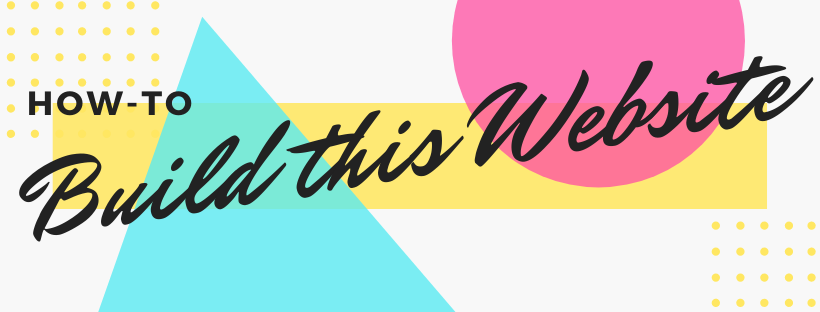
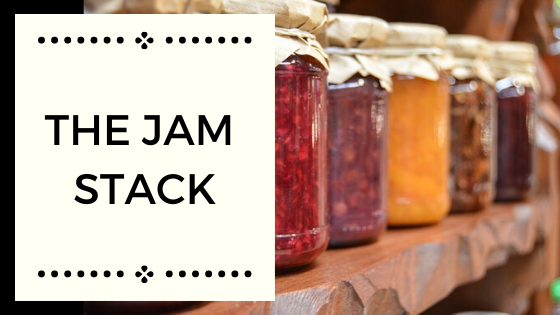

It was time for me to get off of my free WordPress site and work on my development and operations skills. The last time I experimented with making and hosting my own website was when I was in high school making gaming guild websites on GeoCities. So I had a lot to learn. Consider me a complete newbie here. 

## My Website Goals
1. [Use a modern technology stack.](#1-use-a-modern-technology-stack)
2. [Have a feminine and accessible theme.](#2-have-a-feminine-and-accessible-theme)
3. [Function as a blog, resume, and learning playground.](#3-function-as-a-blog-resume-and-learning-playground)

### 1. Use a modern technology stack. 
I did a lot of research on javascript and found myself most interested in the performance and growing adoption of ReactJS. Then I learned about [JAM Stack](https://jamstack.org/), which led me ulitmately to [Gatsby](https://www.gatsbyjs.org). There are definitely other options out there, but this seemed to be the most complete all in one solution that met my goals. Gatsby's [comparison chart to their competitors](https://www.gatsbyjs.org/features/jamstack/) confirmed they had everything I wanted. 

My front-end is built with Gatsby [gatsby-london-night-and-day](https://www.gatsbyjs.org/starters/jooplaan/gatsby-london-night-and-day/). This starter creates a site with a custom, image-centric dark and light mode aware theme for Gatsby. Advanced from the Gatsby starter London After Midnight. GatsbyJs has great documentation including an [in-depth tutorial for creating a site with Gatsby](https://www.gatsbyjs.org/tutorial/). The tutorial starts with zero assumptions about your level of ability and walks through every step of the process.

I tried to minimize the amount of plugins I use, but also as a novice in ReactJS/Gatsby create a professional site which did require the use of a few choice plugins. You can view my [package.json](https://github.com/amyheyen/defensive-stance/blob/master/package.json) on my [GitHub](https://github.com/amyheyen/defensive-stance) to see what libraries I went with.  

Once I got the site content where I wanted it in the developer environment, then I moved on to deployment. This website is hosted on S3 with CloudFront. I chose this deployment because I felt it was the most valuable experience to have for my professional goals. Gatsby provides a general guide on [how to deploy to S3/CloudFront](https://www.gatsbyjs.org/docs/deploying-to-s3-cloudfront/) but they did skip out on some important steps:

* If you want to use a custom domain, ensure you have registered the domain in Route 53 and requested a certificate for the domain via ACM before you start creating the CloudFront distribution.
* After deploying the distribution with a custom domain, when I tried to go to the website, I would get 403 Forbidden Errors. To fix this, I had to set up custom error responses in CloudFront like this blog post recommends: https://johnlouros.com/blog/using-CloudFront-to-serve-an-SPA-from-S3
* Switching between pages was ugly, the navigation bar loaded unevenly which caused the page layout to jumble around for a second while everything loaded. Adding page transitions using this tutorial helped resolve that issue (https://www.gatsbyjs.org/docs/adding-page-transitions-with-plugin-transition-link/).
* The website did not have secure headers. I used the [AWS Tutorial to create a Lambda@Edge function](https://docs.aws.amazon.com/AmazonCloudFront/latest/DeveloperGuide/lambda-edge-how-it-works-tutorial.html) to add CloudFront HTTP security headers. Note: Gatsby does not work with the recommended content-security-policy that AWS suggests 😭. You can remove that line in the AWS example or modify it to allow unsafe-inline & unsafe-eval. I'm still figuring out how to implement either [gatsby-plugin-csp](https://github.com/bejamas/gatsby-plugin-csp) or the steps provided in [Securing a large Gatsby site with a CSP by Carl Vitullo](https://dev.to/vcarl/securing-a-large-gatsby-site-with-a-csp-12f8).
* By default, CloudFront allows TLS 1.0 connections. I recommend to set the security policy setting to only allow TLS 1.2 connections. [All major browsers will be dropping support for TLS 1.0 and TLS 1.1 in 2020](https://www.ghacks.net/2018/10/16/all-major-browsers-drop-tls-1-0-and-1-1-in-2020/) because of known security flaws. 

## 2. Have a feminine and accessible theme.
Previously, I had always made my blogs using masculine coloring like blue, steel, white, and black colors. In my experience, people tend to respect women who have a traditional masculine aesthetic more than those that embrace cuteness. As I've gotten older, I've cared less about what people think about the cuteness, as long as the website is accessible. Maybe by having more cute blogs, we can welcome a broader range of folks into the industry.

Accesibility (a11y) in development is something I am still working on. Following some front-end engineers on Twitter has opened my eyes to the accesibility testing features built into developer tools. There is the (Lighthouse audit tool)[https://developers.google.com/web/tools/lighthouse/] built into Chrome and the (Accesibility Inspector)[https://developer.mozilla.org/en-US/docs/Tools/Accessibility_inspector?utm_source=devtools&utm_medium=a11y-panel-description] built into Firefox that provide action items to improve accessibility. I know I still have a lot of work to do and I look forward to learning more.  

## 3. Function as a blog, resume, and learning playground.
The entire reason I have a website is to serve content that both shares learning materials and shows potential employers that I might know a few things. Currently, I'm a Cyber Security Analyst. I understand security tools and can provide recommendations across the organization, but those recommendations are not complete solutions with action items, just very high level goals. I am working towards becoming a [DevSecOps](https://www2.deloitte.com/us/en/insights/focus/tech-trends/2019/embedding-security-devops-pipelines-devsecops.html) Engineer, where I will understand how to implement security throughout the application development pipeline. This website will be where I practice what I learn to reach this goal. Stay tuned folks!