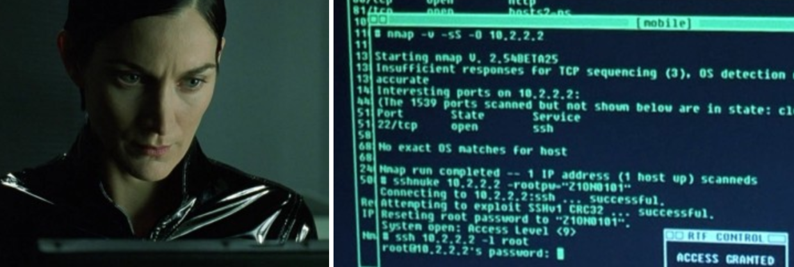
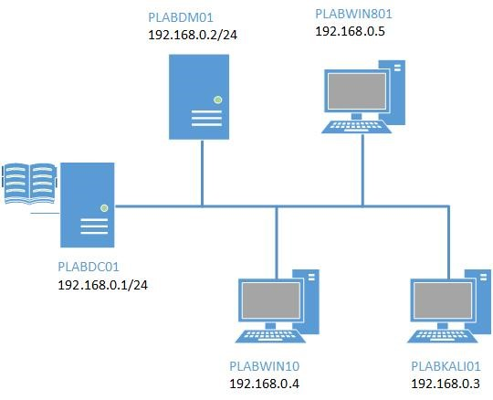
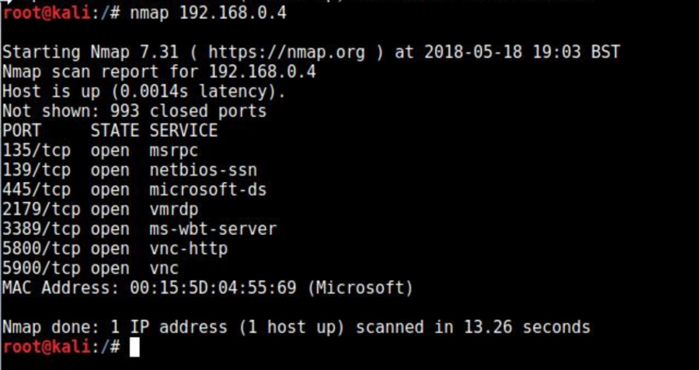
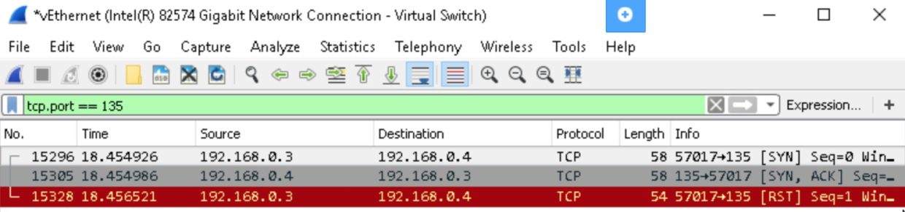
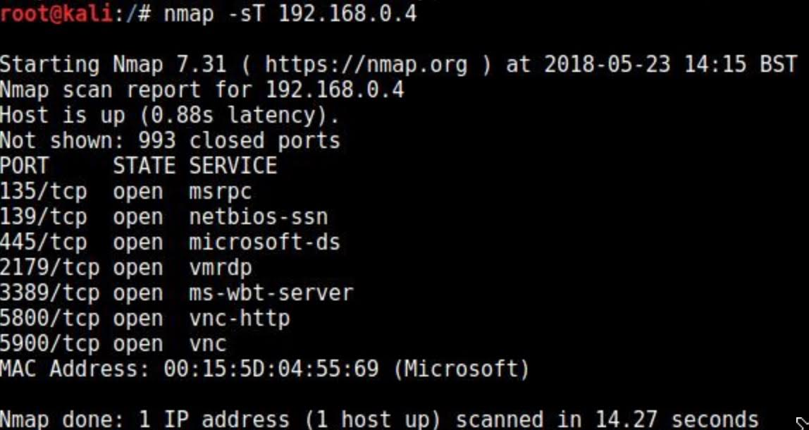
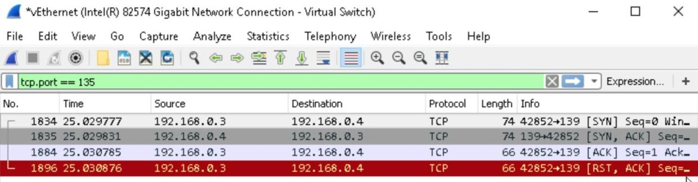
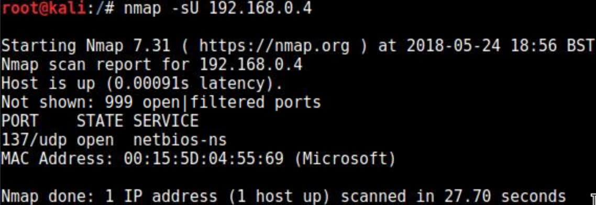
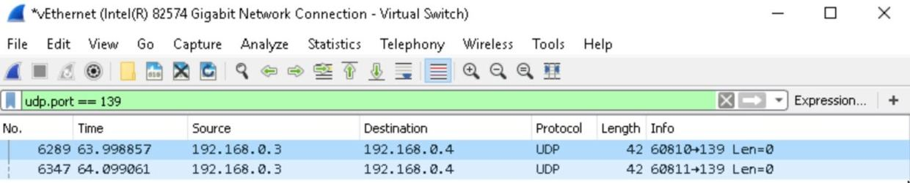

<small>Photo by <a href="https://unsplash.com/@yusufevli" target="_blank" rel="noopener noreferrer">Yusuf Evli on Unsplash</a></small>

Nmap and Wireshark are both tools referenced in the Threat Management section of of CySA+. I noticed in my virtual lab it has you do a lot of Nmap commands with different options but didn’t really get into the different reasons you might use that command. In the free [Cybrary CySA+ videos](https://www.cybrary.it/course/comptia-csa-threat-management/), the instructor, Mohamed Atef, runs a couple Nmap techniques while running Wireshark and was able to see the resulting packets in [this lecture](https://www.cybrary.it/video/advanced-scanning-techniques/). I found this useful in providing context to the tools and education so far.

<small><i>Fun fact: <a href="https://nmap.org/movies/"> Hollywood loves Nmap.</a></i></small>

**Goal of Exercise:** Get experience with port scanning and packet capture programs as well as analyzing some of the [different port scanning techniques](https://nmap.org/book/man-port-scanning-techniques.html) as listed by Nmap and their impact on the network.

**Pre-requisites:** Have a virtual lab setup with 2 boxes and a basic network, or two computers over a network.

Target CySA+ Exam Objectives: Threat Management (27% of exam)

* CS0-001 1.1: Given a scenario, apply environmental reconnaissance techniques using appropriate tools and processes
* CS0-001 1.2: Given a scenario, analyze the results of a network reconnaissance

Here’s my network for this exercise:

<small><i>Note: For these examples, I am using the PLABKALI01 192.168.0.3 to port scan the PLABWIN10 192.168.0.4 machine.</i></small>

1. Run wireshark on the target computer and start a capture on the interface that connected the two boxes.
2. Run a vanilla nmap command on the “attacker” box to the target box. This will run a TCP SYN Scan by default.

`nmap 192.168.0.4`

<small><i>Note: This outputs a list of open ports, the protocol that was tested, and the service associated with that port. Also note the MAC Address and the vendor in parenthesis for the MAC.</i></small>

3. Stop your Wireshark packet capture after you run the command. Filter the capture by one of the open ports you identified.

<small><i>Note: The resulting packets are a SYN, a SYN, ACK and then a RST. This shows you that the 3-way handshake doesn’t complete which makes the scan faster, and more stealthy.</i></small>

4. Start a new packet capture in Wireshark and run a TCP connect scan.

`nmap -sT 192.168.0.4`

<small><i>Note: The output looks just like the TCP SYN scan, but took slightly longer. Consider if you were scanning an entire network. The additional time would add up.</i></small>

5. Stop your packet capture and filter by an open port from your Nmap results.

<small><i>Note: Although the Nmap results looked the same, you’ll see the difference in your packet capture. The TCP Connect scan does a full 3-way handshake.</i></small>

6. Start a new packet capture in Wireshark and run a UDP scan.

`nmap -sU 192.168.0.4`

<small><i>Note: So you’ll see only one UDP port was available on this scan. This port did not show up in the previous scans. Bonus Activity: Visit SANS Internet Storm Center and review UDP port 137.</i></small>

7. Stop your packet capture and filter by an open port from your Nmap results.

<small><i>Note: UDP connections do not require a handshake, they are more for services that are okay with dropping some packets, but need to be fast.</i></small>

8. Now that you have the idea of the practice exercise, continue the same exercise for the rest of the list and analyze their outputs.

Running a scan or a packet capture is easy. Understanding what the tool is doing and the results takes critical thinking skills and experience. From my understanding of the CySA+ scenario questions, you are expected to understand results for the exam and their implications.